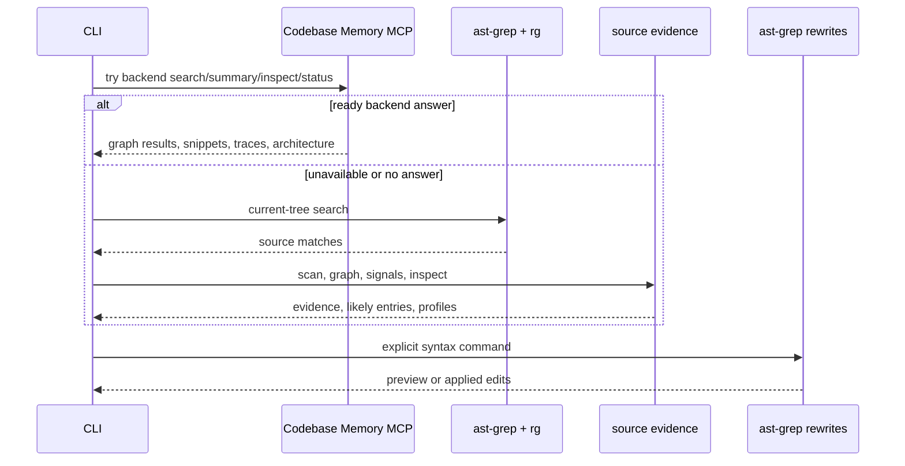
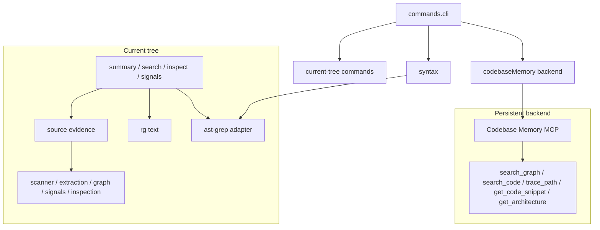

# Codemap Architecture

Codemap is a syntax-aware source inspection CLI. It wraps `rg`, ast-grep, source scanning, lightweight relationship evidence, and refactor signals for current-tree agent work. It does not own a persistent graph store; Codebase Memory MCP is the persistent graph backend when an indexed backend is available.

## Design Intent

Codemap is an agent-facing source navigation and refactor-scoping tool. It should stay small, direct, and current-tree first.

- Current-tree commands inspect live files and do not write Codemap-owned graph storage.
- `src/codemap/ast-grep` is the shared ast-grep boundary; `rg` stays the subprocess boundary for text search and file discovery.
- `search` is broad discovery; `inspect <target>` is the explicit path for one known file, symbol, or neighborhood.
- Codebase Memory MCP is the optional backend for persistent graph search, semantic graph search, snippets, traces, architecture summaries, and backend status.
- `signals` are neutral refactor evidence, not lint findings.

## Install

Use `pnpm` for repo dependencies and builds, then use `npm` for the global CLI install:

```sh
pnpm install
pnpm run build
npm install -g .
```

For agent use, enable the Codemap skill in the matching agent guidance so agents know when to reach for `codemap` before broad refactor or architecture work.

## Command Surface

| Area | Commands | Reads | Writes / guard | Purpose |
| --- | --- | --- | --- | --- |
| Current tree | `summary`, `signals [section]` | Current tree, optional Codebase Memory backend | None | Orientation and refactor evidence. |
| Current tree | `search <text>`, `inspect <target>` | Current tree, optional Codebase Memory backend | None | Discovery and focused source neighborhoods. |
| Current tree | `search --graph <text>` | Codebase Memory backend when ready, otherwise derived current-tree graph | None | Relationship context when text matches need structure. |
| Current tree | `search --semantic <text>` | Codebase Memory backend when ready, otherwise current-tree fallback | None | Persistent semantic graph search without Codemap-owned indexes. |
| Backend status | `semantic status` | Codebase Memory backend | None | Show whether the persistent graph backend is ready for this project. |
| Structural search | `search match`, `calls`, `rule` | Current tree plus pattern or rule input | None | Explicit read-only ast-grep matches under the search surface. |
| Syntax operations | `syntax replace-call`, `replace`, `rename`, `debug`, `preview`, `rule`, `recipe` | Current tree plus recipe or rule input | Source files only with `--apply --yes` | Mechanical ast-grep rewrites, renames, previews, and pattern debugging. |

## Runtime Model



## Module Ownership



## Architecture Notes

- Codemap-owned persistent artifacts and local semantic indexes are intentionally absent.
- Source evidence lives in `src/codemap/source`: scanner, extraction, graph, signals, inspection.
- ast-grep usage is centralized in `src/codemap/ast-grep`; `rg` stays a subprocess boundary.
- Search lanes are direct code boundaries: `src/codemap/search/source`, `src/codemap/search/structural`, and `src/codemap/search/graph`.
- `src/codemap/codebaseMemory` owns the optional persistent backend adapter and renderer shortcuts.
- `src/codemap/syntax` packages ast-grep operations: previews, recipes, rewrites, renames, pattern debugging, and apply-capable YAML rules.
