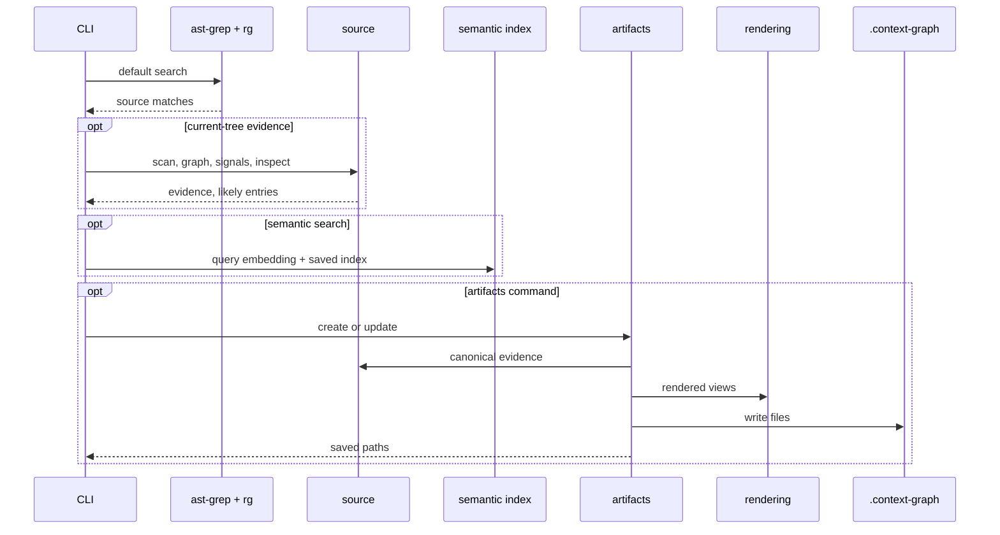
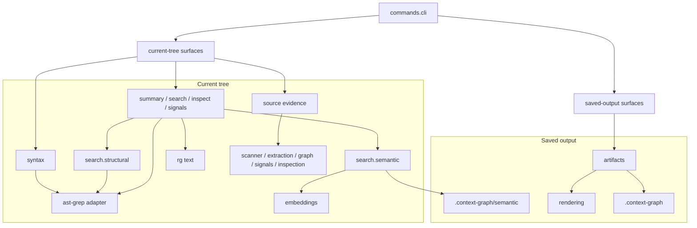

# Codemap Architecture

Codemap is a syntax-aware source inspection CLI built around a shared ast-grep layer, rg text/file discovery, signal tables, and focused relationship context. Graph payloads are internal evidence and optional saved artifacts; normal commands inspect the current files directly.

## Design Intent

Codemap is an agent-facing source navigation and refactor-scoping tool. It brings ast-grep, rg, semantic search, and lightweight code signals into one CLI without becoming an IDE, compiler, language server, graph database, lint framework, or ast-grep project manager.

- Current-tree commands inspect live files and do not write saved artifacts.
- `src/codemap/ast-grep` is the shared ast-grep boundary; `rg` stays the subprocess boundary for text search and file discovery.
- `search` is broad discovery; `inspect <target>` is the explicit path for one known file, symbol, or neighborhood.
- `src/codemap/search` has four lanes: `source` for ast-grep/rg, `structural` for explicit ast-grep pattern matching, `graph` for relationship-context search, and `semantic` for embedding-backed saved-index search.
- `signals` are neutral refactor evidence, not lint findings.
- Saved outputs are opt-in: `artifacts` writes `.context-graph`; `semantic init` creates the semantic index.

## Command Surface

<table>
<thead>
<tr>
<th>Area</th>
<th>Commands</th>
<th>Reads</th>
<th>Writes / guard</th>
<th>Purpose</th>
</tr>
</thead>
<tbody>
<tr>
<td rowspan="4" valign="middle"><strong>Current tree</strong></td>
<td><code>summary</code>, <code>signals [section]</code></td>
<td rowspan="3" valign="middle">Current tree</td>
<td rowspan="2" valign="middle">None</td>
<td>Orientation and refactor evidence.</td>
</tr>
<tr>
<td><code>search &lt;text&gt;</code>, <code>inspect &lt;target&gt;</code></td>
<td>Discovery and focused source neighborhoods.</td>
</tr>
<tr>
<td><code>search --graph &lt;text&gt;</code></td>
<td>None; explicit <code>--graph</code></td>
<td>Relationship context when text matches need structure.</td>
</tr>
<tr>
<td><code>search --semantic &lt;text&gt;</code></td>
<td>Current tree plus semantic index</td>
<td>Requires <code>semantic init</code></td>
<td>Embedding search without ambient indexing.</td>
</tr>
<tr>
<td><strong>Structural search</strong></td>
<td><code>search match</code>, <code>calls</code>, <code>rule</code></td>
<td>Current tree plus pattern or rule input</td>
<td>None</td>
<td>Explicit read-only ast-grep matches under the search surface.</td>
</tr>
<tr>
<td><strong>Syntax operations</strong></td>
<td><code>syntax replace-call</code>, <code>replace</code>, <code>rename</code>, <code>debug</code>, <code>preview</code>, <code>rule</code>, <code>recipe</code></td>
<td>Current tree plus recipe or rule input</td>
<td>Source files only with <code>--apply --yes</code></td>
<td>Mechanical ast-grep rewrites, renames, previews, and pattern debugging.</td>
</tr>
<tr>
<td rowspan="2" valign="middle"><strong>Saved output</strong></td>
<td><code>artifacts create</code>, <code>update</code></td>
<td>Current tree</td>
<td><code>.context-graph</code></td>
<td>Point-in-time handoff artifacts and rendered views.</td>
</tr>
<tr>
<td><code>artifacts status</code>, <code>view</code></td>
<td><code>.context-graph</code></td>
<td>None</td>
<td>Read saved artifact state and output.</td>
</tr>
<tr>
<td><strong>Search index</strong></td>
<td><code>semantic init</code>, <code>status</code></td>
<td>Current tree or semantic index</td>
<td><code>.context-graph/semantic</code> for <code>init</code></td>
<td>Build and inspect the saved embedding index.</td>
</tr>
</tbody>
</table>

## Runtime Model

## Module Ownership

## Architecture Notes

- Current-tree commands are artifact-free.
- Source evidence lives in `src/codemap/source`: scanner, extraction, graph, signals, inspection.
- ast-grep usage is centralized in `src/codemap/ast-grep`; `rg` stays a subprocess boundary.
- Search lanes are direct code boundaries: `src/codemap/search/source`, `src/codemap/search/structural`, `src/codemap/search/graph`, and `src/codemap/search/semantic`.
- Semantic owns embeddings, semantic cards, saved index IO, and scoring because it is embedding-backed search, not a separate artifact system.
- `src/codemap/syntax` packages ast-grep operations: previews, recipes, rewrites, renames, pattern debugging, and apply-capable YAML rules.
- Rendering builds payloads; artifacts decide when to write `.context-graph`.
- `semantic init` builds the saved embedding corpus; `search --semantic` embeds only the query and searches that index.
