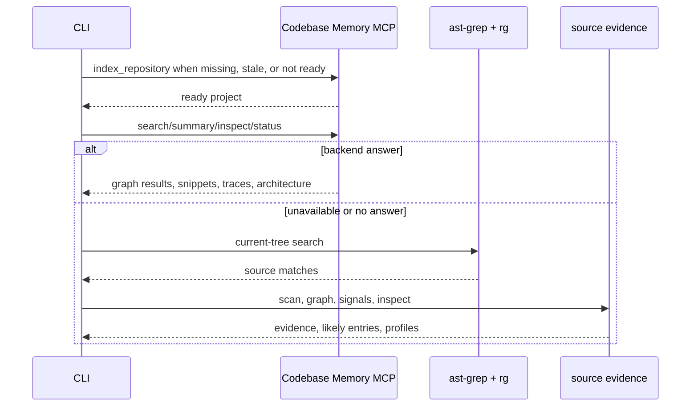
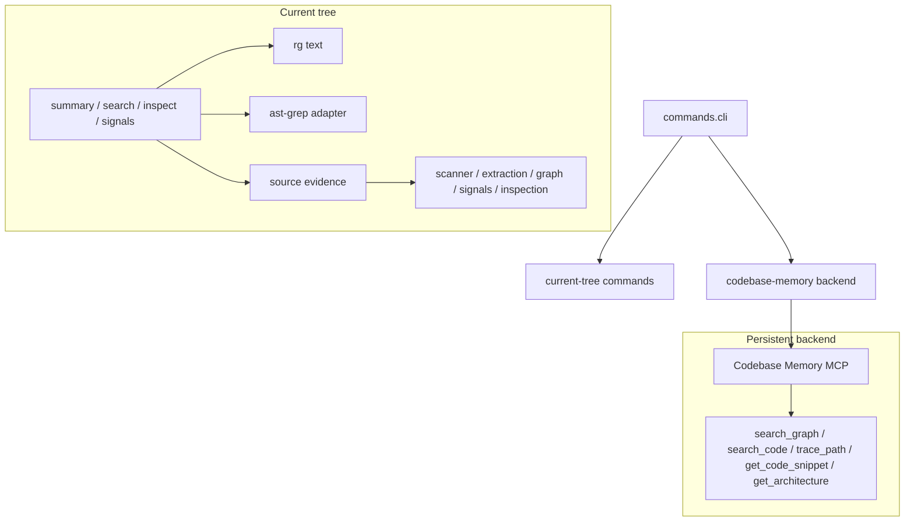

# Codemap Architecture

Codemap is a syntax-aware source inspection CLI. It wraps Codebase Memory MCP where the backend already has useful graph, search, trace, snippet, architecture, and status primitives, then uses `rg`, ast-grep, source scanning, lightweight relationship evidence, and refactor signals for local gaps. It does not own a persistent graph store; Codebase Memory MCP is the persistent graph backend.

## Design Intent

Codemap is an agent-facing source navigation and refactor-scoping tool. It should stay small, direct, and current-tree first.

- Backend-backed commands synchronously ask Codebase Memory MCP to index the project before querying, so Codemap does not knowingly serve stale graph data.
- Current-tree commands inspect live files and do not write Codemap-owned graph storage.
- `src/codemap/ast-grep` is the shared ast-grep boundary; `rg` stays the subprocess boundary for text search and file discovery.
- `search` is broad discovery; `inspect <target>` is the explicit path for one known file, symbol, or neighborhood.
- Codebase Memory MCP is the backend for persistent graph search, semantic graph search, snippets, traces, architecture summaries, and backend status.
- `signals` are neutral refactor evidence, not lint findings.

## Install

Use `pnpm` for repo dependencies and builds, then use `npm` for the global CLI install:

```sh
pnpm install
pnpm run build
npm install -g .
```

For agent use, enable the Codemap skill in the matching agent guidance so agents know when to reach for `codemap` before broad refactor or architecture work.

## Command Surface

| Area | Commands | Reads | Writes / guard | Purpose |
| --- | --- | --- | --- | --- |
| Backend wrappers | `summary`, `search <text>`, `search --graph <text>`, `search --semantic <text>`, `inspect <symbol>`, `search calls <name>`, `semantic status` | Codebase Memory MCP after synchronous indexing, with local fallback where useful | Backend index only | Discovery, focused source neighborhoods, traces, architecture, snippets, and status. |
| Current tree | `signals [section]`, path/file `inspect <target>` | Current tree | None | Refactor evidence and direct file or directory inspection. |
| Structural search | `search match`, `search rule`, scoped `search calls` | Current tree plus pattern, rule, language, or path input | None | Explicit read-only ast-grep matches under the search surface. |

## Runtime Model



## Module Ownership



## Architecture Notes

- Codemap-owned persistent artifacts and local semantic indexes are intentionally absent.
- Source evidence lives in `src/codemap/source`: scanner, extraction, graph, signals, inspection.
- ast-grep usage is centralized in `src/codemap/ast-grep`; `rg` stays a subprocess boundary.
- Search lanes are direct code boundaries: `src/codemap/search/source`, `src/codemap/search/structural`, and `src/codemap/search/graph`.
- `src/codemap/codebase-memory` owns the persistent backend adapter, freshness checks, indexing trigger, and renderer shortcuts.
